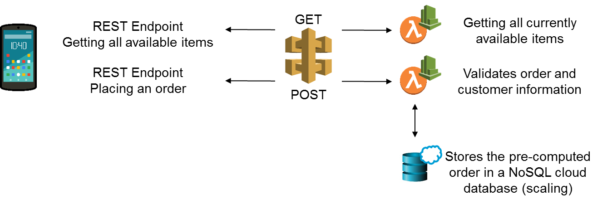

# Cloud Function Demo

## Setup

### AWS Account

Get an AWS account to start your cloud experience on Amazon Web Services: https://aws.amazon.com/

### Eclipse Plugin

Installing AWS Toolkit for Eclipse.
Eclipse / Help / Install New Software / Work with: https://aws.amazon.com/eclipse and press Enter.

Select AWS Toolkit for Eclipse Core in the AWS Core Management Tools section plus other components you want to use.

Further Information: https://docs.aws.amazon.com/toolkit-for-eclipse/v1/user-guide/setup-install.html

### Setting up your AWS credentials

Installing the AWS CLI on your machine.

To be able to use the Eclipse AWS Plugin, you have to configure your AWS Credentials. Further information: https://docs.aws.amazon.com/toolkit-for-eclipse/v1/user-guide/setup-credentials.html

## Szenario

This is the overview of our scenario, including an API Gateway with a GET and POST method, two AWS Lambda Functions and a DynamoDb with a single table to store the orders.



## Get all items cloud Function - Doing all steps manually

Eclipse / File / New / Other / AWS / AWS Lambda Project

Use **Custom** as Input Type. Dependent on your use case, you can also use a pre-integrated type such as S3 Event or SNS Event and many more.

Implement your logic and deploy your function to a selected region. Therefore go to your handler class:

Right click -> AWS Lambda -> Upload Function to AWS Lambda:
 - Check the selected handler class
 - Select a region of your choice
 - Create a new Lambda function
 - Click **Next**
 - Create IAM Role and name it
 - Create S3 Bucket (storage location for your source code) and name it
 - Specify memory, e.g. 512
 - Timeout: 15
 - Click **Finish**

Test your function via the test utility in your lambda console on AWS.

## POST function - Store items in DynamoDb

A sample **post.json** is included in the project structure.

## Automating your Infrastructure Creation via CloudFormation

Because setting up every component (DynamoDb, API Gateway, IAM, Lambdas) is tedious, we use **Infrastructure as Code** offering on AWS to automate this and ease our application setup.

To setup your infrastructure and defining your application as presented in the scenario, execute the following bash command.
There is a temporary file created, since the S3 bucket name must be unique within the AWS cloud.
Therefore a random string generation is used and the bucket name is stored in this config file:

```bash
>bash deploy
```

To tear down your infrastructure and delete all artifacts on your cloud provider's ecosystem, execute:

```bash
>bash undeploy
```

**REMARKS**

Suffix **--capabilities CAPABILITY_NAMED_IAM** is needed since we are creating a IAM Role for our lambda functions.

**Useful Tools**

 ```bash
 >cfn-flip cloudFormation.json cloudFormation.yaml
 ```
For deploying your CloudFormation stack via the CLI, the .yaml configuration is used. Since writing YAML is error-prone and tedious, the AWS Labs on GitHub presented a tool to convert JSON to valid YAML, which was used during development.

 Source: https://github.com/awslabs/aws-cfn-template-flip
